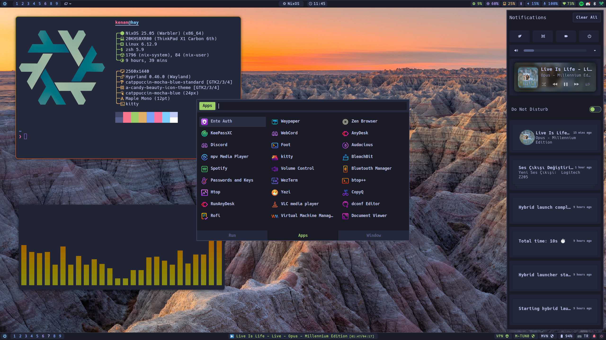
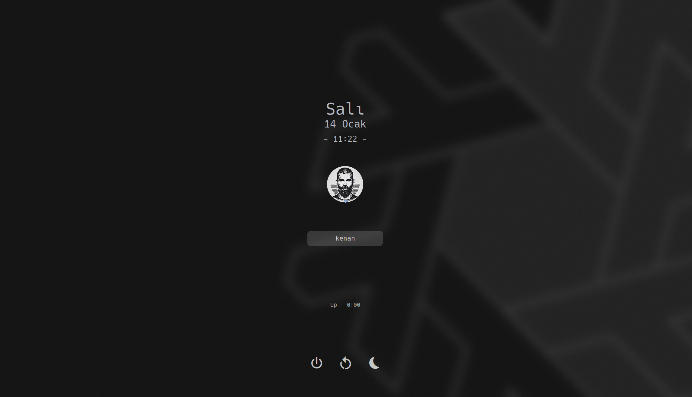
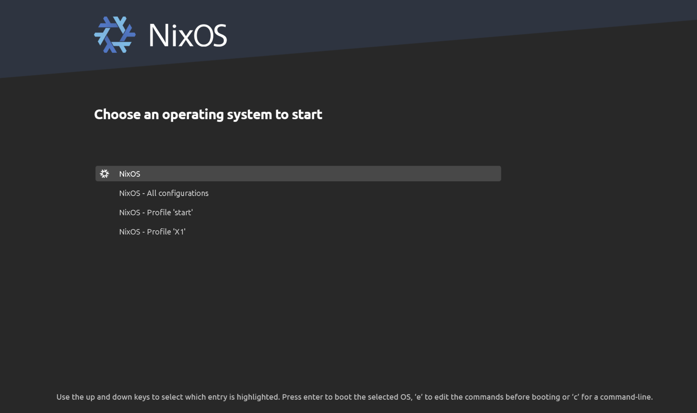

# NixOS Configuration

<div align="center">
   
   <br>
      Kenan's NixOS Configuration 
   <br>
       <br>

   <div>
      <p></p>
      <div>
         <a href="https://github.com/kenanpelit/nixosc/stargazers">
            
         </a>
         <a href="https://github.com/kenanpelit/nixosc/">
            
         </a>
         <a href="https://nixos.org">
            
         </a>
         <a href="https://github.com/kenanpelit/nixosc/blob/main/LICENSE">
            
         </a>
      </div>
      <br>
   </div>
</div>

## 🖼️ Gallery

<p align="center">
    <br>
    <br>
    <br>

</p>

## 🗃️ Overview

### 📚 Layout

-   [flake.nix](flake.nix) - Base of the configuration
-   [hosts](hosts) - 🌳 Per-host configurations
    - [hay](hosts/hay/) - 💻 Laptop configuration
    - [vhay](hosts/vhay/) - 🗄️ VM configuration
-   [modules](modules) - 🍱 Modularized NixOS configurations
    -   [core](modules/core/) - ⚙️ Core NixOS configuration
    -   [homes](modules/home/) - 🏠 Home-Manager configuration
-   [themes](themes/) - 🎨 Catppuccin Mocha
-   [wallpapers](wallpapers/) - 🌄 Wallpapers collection

## 📓 Components

|                             | NixOS + Hyprland                                                                              |
| --------------------------- | :---------------------------------------------------------------------------------------------: |
| **Window Manager**          | [Hyprland][Hyprland] |
| **Bar**                     | [Waybar][Waybar] |
| **Application Launcher**    | [rofi][rofi] |
| **Notification Daemon**     | [swaync][swaync] |
| **Terminal Emulator**       | [Kitty][Kitty] + [Wezterm][Wezterm] + [Foot][Foot] |
| **Shell**                   | [zsh][zsh] + [oh-my-zsh][oh-my-zsh] + [p10k][p10k] |
| **Text Editor**             | [Neovim][Neovim] |
| **Network Management Tool** | [iwd][iwd] + [iwgtk][iwgtk] |
| **System Resource Monitor** | [Btop][Btop] |
| **File Manager**            | [nemo][nemo] + [yazi][yazi] |
| **Fonts**                   | [Hack Nerd Font][Nerd fonts] + [Maple Mono][Maple Mono] |
| **Color Scheme**            | [Catppuccin Mocha][Catppuccin] |
| **Cursor**                  | [catppuccin-mocha-blue-cursors][catppuccin-cursors] |
| **Icons**                   | [Papirus-Dark][Papirus-Dark] |
| **Lockscreen**             | [Hyprlock][Hyprlock] + [Swaylock-effects][Swaylock-effects] |
| **Image Viewer**            | [qview][qview] |
| **Media Player**            | [mpv][mpv] |
| **Music Player**            | [audacious][audacious] |
| **Screenshot Software**     | [grimblast][grimblast] |
| **Screen Recording**        | [wf-recorder][wf-recorder] |
| **Clipboard**               | [wl-clip-persist][wl-clip-persist] + [CopyQ][CopyQ] |
| **Color Picker**            | [hyprpicker][hyprpicker] |

## 🚀 Installation 

> [!CAUTION]
> This configuration may affect your system's behavior. While tested on specific setups, there's no guarantee it will work perfectly on yours.
> **Use at your own risk - I am not responsible for any issues that may arise.**

### Prerequisites

- A fresh NixOS installation (tested with Gnome ISO, "No desktop" option)
- Git
- Basic understanding of NixOS and flakes

### Installation Steps

#### 1. **Fresh NixOS Installation**

First, install NixOS using the [official graphical ISO](https://nixos.org/download.html#nixos-iso).

> [!NOTE]
> Testing has been done using the Gnome graphical installer with the "No desktop" option selected.

#### 2. **Get the Configuration**

<table>
<tr>
<td width="50%">

After the base NixOS installation, open a terminal and run:

```bash
nix-shell -p git pv vim
git clone https://github.com/kenanpelit/nixosc ~/.nixosc
cd ~/.nixosc
```
</td>
<td width="50%">

> [!IMPORTANT]  
> Before proceeding with the installation, customize your localization settings in:
> - `hosts/hay/templates/initial-configuration.nix` (for laptop)
> - `hosts/vhay/templates/initial-configuration.nix` (for VM)
>
> Current defaults:
> - ⏰ Time Zone: "Europe/Istanbul"
> - 🌐 System Language: "en_US.UTF-8"
> - 🌍 Regional Settings: Turkish (tr_TR.UTF-8)
> - ⌨️ Keyboard Layout: Turkish-F
>

</td>
</tr>
</table>

#### 3. **Initial System Setup**

Choose one of these methods:

##### A) Automatic Setup (Recommended)

```bash
# For laptop installation:
./install.sh -a hay --pre-install

# For VM installation:
./install.sh -a vhay --pre-install
```

The script will:
- Set up initial configuration
- Perform basic system configuration
- Request a reboot when done

After rebooting, complete the installation:
```bash
# For laptop:
./install.sh -a hay

# For VM:
./install.sh -a vhay
```

##### B) Manual Setup
1. Copy the appropriate configuration:
```bash
# For laptop:
sudo cp hosts/hay/templates/initial-configuration.nix /etc/nixos/configuration.nix

# For VM:
sudo cp hosts/vhay/templates/initial-configuration.nix /etc/nixos/configuration.nix
```

2. Build the initial system:
```bash
sudo nixos-rebuild switch --profile-name start
```

3. Reboot and run the main installation:
```bash
./install.sh
```

#### 4. **Post-Installation**

1. Update Git configuration in `./modules/home/git/default.nix`:
```nix
programs.git = {
   userName = "Your Name";
   userEmail = "your.email@example.com";
};
```

2. Reboot your system
3. Log in - you'll be greeted by hyprlock

#### 5. **Manual Configuration**

Some components need manual configuration:
- Discord theme (in Discord settings under VENCORD > Themes)
- Browser configuration

## ⌨️ Shell Aliases

<details>
<summary>Utils</summary>

- ```c```     → ```clear```
- ```cd```    → ```z```
- ```tt```    → ```gtrash put```
- ```vim```   → ```nvim```
- ```cat```   → ```bat```
- ```nano```  → ```micro```
- ```code```  → ```codium```
- ```py```    → ```python```
- ```icat```  → ```kitten icat```
- ```dsize``` → ```du -hs```
- ```pdf```   → ```tdf```
- ```open```  → ```xdg-open```
- ```space``` → ```ncdu```
- ```man```   → ```BAT_THEME='default' batman```
- ```l```     → ```eza --icons -a --group-directories-first -1```
- ```ll```    → ```eza --icons -a --group-directories-first -1 --no-user --long```
- ```tree```  → ```eza --icons --tree --group-directories-first```
</details>

<details>
<summary>NixOS</summary>

- ```cdnix```      → ```cd ~/nixosc && codium ~/nixosc```
- ```ns```         → ```nom-shell --run zsh```
- ```nix-test```   → ```nh os test```
- ```nix-switch``` → ```nh os switch```
- ```nix-update``` → ```nh os switch --update```
- ```nix-clean```  → ```nh clean all --keep 5```
- ```nix-search``` → ```nh search```
</details>

<details>
<summary>Git</summary>

- ```g```     → ```lazygit```
- ```gf```    → ```onefetch --number-of-file-churns 0 --no-color-palette```
- ```ga```    → ```git add```
- ```gaa```   → ```git add --all```
- ```gs```    → ```git status```
- ```gb```    → ```git branch```
- ```gm```    → ```git merge```
- ```gd```    → ```git diff```
- ```gpl```   → ```git pull```
- ```gplo```  → ```git pull origin```
- ```gps```   → ```git push```
- ```gpso```  → ```git push origin```
- ```gpst```  → ```git push --follow-tags```
- ```gcl```   → ```git clone```
- ```gc```    → ```git commit```
- ```gcm```   → ```git commit -m```
- ```gcma```  → ```git add --all && git commit -m```
- ```gtag```  → ```git tag -ma```
- ```gch```   → ```git checkout```
- ```gchb```  → ```git checkout -b```
- ```glog```  → ```git log --oneline --decorate --graph```
- ```glol```  → ```git log --graph --pretty='%Cred%h%Creset -%C(auto)%d%Creset %s %Cgreen(%ar) %C(bold blue)<%an>%Creset'```
- ```glola``` → ```git log --graph --pretty='%Cred%h%Creset -%C(auto)%d%Creset %s %Cgreen(%ar) %C(bold blue)<%an>%Creset' --all```
- ```glols``` → ```git log --graph --pretty='%Cred%h%Creset -%C(auto)%d%Creset %s %Cgreen(%ar) %C(bold blue)<%an>%Creset' --stat```
</details>

## ⌨️ Keybindings

Press ```$mainMod F1``` to view all keybindings and ```$mainMod w``` for the wallpaper picker. 
Default ```$mainMod``` is the ```SUPER``` key.

<details>
<summary>View All Keybindings</summary>

##### General
- ```$mainMod, F1``` - Show keybinds list
- ```$mainMod, Return``` - Launch terminal (wezterm)
- ```ALT, Return``` - Launch floating terminal
- ```$mainMod SHIFT, Return``` - Launch fullscreen terminal
- ```$mainMod, B``` - Launch browser
- ```$mainMod, Q``` - Close active window
- ```$mainMod, Space``` - Toggle floating
- ```$mainMod, D``` - Launch application launcher (rofi)
- ```$mainMod, Escape``` - Lock screen
- ```ALT, Escape``` - Alternative lock screen
- ```$mainMod SHIFT, Escape``` - Power menu

##### Workspace Management
- ```$mainMod, 1-9``` - Switch to workspace 1-9
- ```$mainMod SHIFT, 1-9``` - Move window to workspace 1-9
- ```$mainMod CTRL, c``` - Move to empty workspace

##### Window Management
- ```$mainMod, left/right/up/down``` - Focus window
- ```$mainMod SHIFT, left/right/up/down``` - Move window
- ```$mainMod CTRL, left/right/up/down``` - Resize window
- ```$mainMod ALT, left/right/up/down``` - Move window precisely

##### Media Controls
- ```XF86AudioRaiseVolume``` - Volume up
- ```XF86AudioLowerVolume``` - Volume down
- ```XF86AudioMute``` - Toggle mute
- ```XF86AudioPlay``` - Play/pause
- ```XF86AudioNext``` - Next track
- ```XF86AudioPrev``` - Previous track

##### Screenshots
- ```$mainMod, Print``` - Save area screenshot
- ```Print``` - Copy area screenshot

[Full keybinding configuration](modules/home/hyprland/conf/hyprland.conf)
</details>

## 🛠️ Customization

### Adding New Packages

Edit `modules/home/default.nix` to add user packages or `modules/core/default.nix` for system-wide packages.

### Changing Themes

The configuration uses Catppuccin Mocha by default. Theme files are in the `themes/` directory.

### Wallpapers

Add custom wallpapers to `wallpapers/` directory. Use ```$mainMod w``` to access the wallpaper picker.

## 📚 Documentation

For more detailed information:
- [NixOS Manual](https://nixos.org/manual/nixos/stable/)
- [Home Manager Manual](https://nix-community.github.io/home-manager/)
- [Hyprland Documentation](https://wiki.hyprland.org/)

## 👥 Credits

Special thanks to:
- [Frost-Phoenix/nixos-config](https://github.com/Frost-Phoenix/nixos-config) for inspiration and examples
- [All component creators](#components)

## 📄 License

This project is licensed under the MIT License - see the [LICENSE](LICENSE) file for details.

<!-- Component Links -->
[Hyprland]: https://github.com/hyprwm/Hyprland
[Kitty]: https://github.com/kovidgoyal/kitty
[Wezterm]: https://wezfurlong.org/wezterm/index.html
[Foot]: https://codeberg.org/dnkl/foot
[Starship]: https://github.com/starship/starship
[Waybar]: https://github.com/Alexays/Waybar
[rofi]: https://github.com/lbonn/rofi
[Btop]: https://github.com/aristocratos/btop
[nemo]: https://github.com/linuxmint/nemo/
[yazi]: https://github.com/sxyazi/yazi
[zsh]: https://ohmyz.sh/
[oh-my-zsh]: https://ohmyz.sh/
[p10k]: https://github.com/romkatv/powerlevel10k
[Swaylock-effects]: https://github.com/mortie/swaylock-effects
[Hyprlock]: https://github.com/hyprwm/hyprlock
[audacious]: https://audacious-media-player.org/
[mpv]: https://github.com/mpv-player/mpv
[Neovim]: https://github.com/neovim/neovim
[grimblast]: https://github.com/hyprwm/contrib
[qview]: https://interversehq.com/qview/
[swaync]: https://github.com/ErikReider/SwayNotificationCenter
[Nerd fonts]: https://github.com/ryanoasis/nerd-fonts
[Maple Mono]: https://github.com/subframe7536/maple-font
[iwd]: https://git.kernel.org/pub/scm/network/wireless/iwd.git/
[iwgtk]: https://github.com/J-Lentz/iwgtk
[wl-clip-persist]: https://github.com/Linus789/wl-clip-persist
[CopyQ]: https://hluk.github.io/CopyQ/
[wf-recorder]: https://github.com/ammen99/wf-recorder
[hyprpicker]: https://github.com/hyprwm/hyprpicker
[Catppuccin]: https://github.com/catppuccin/catppuccin
[catppuccin-cursors]: https://github.com/catppuccin/cursors
[Papirus-Dark]: https://github.com/PapirusDevelopmentTeam/papirus-icon-theme
