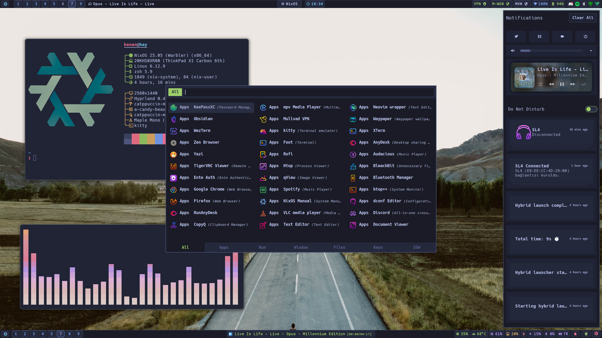

# NixOS Configuration Suite (nixosc)

<div align="center">
   
   <br>
      Kenan's NixOS Configuration Suite
   <br>
       <br>

   <div>
      <p></p>
      <div>
         <a href="https://github.com/kenanpelit/nixosc/stargazers">
            
         </a>
         <a href="https://github.com/kenanpelit/nixosc/">
            
         </a>
         <a href="https://nixos.org">
            
         </a>
         <a href="https://github.com/kenanpelit/nixosc/blob/main/LICENSE">
            
         </a>
      </div>
      <br>
   </div>
</div>

## 🖼️ Gallery

<p align="center">
    <br>
    <br>
    <br>
</p>

## 📋 Project Overview

**NixOS Configuration Suite (nixosc)** - Snowfall Edition

A comprehensive NixOS system configuration management suite built on the **Snowfall Lib** framework. It provides a unified, modular approach to managing both system-level configuration (NixOS) and user environments (Home Manager).

- **Architecture:** Snowfall Lib (Automatic module discovery)
- **Desktop:** Hyprland (Wayland) with Waybar, Rofi, Mako
- **Theme:** Catppuccin Mocha everywhere
- **Shell:** Zsh + Starship + Tmux
- **Secrets:** SOPS-Nix with Age encryption

## 🗃️ Repository Structure

The project follows modern Snowfall Lib standards:

- [flake.nix](flake.nix) - Core configuration entry point
- [install.sh](install.sh) - Unified installation & management tool
- [systems](systems) - ❄️ Host configurations
  - [hay](systems/x86_64-linux/hay/) - 💻 Laptop/Workstation
  - [vhay](systems/x86_64-linux/vhay/) - 🗄️ Virtual Machine
- [modules](modules) - 🍱 Modular configurations
  - [nixos](modules/nixos/) - ⚙️ System-level modules (hardware, services)
  - [user-modules](modules/user-modules/) - 🏠 User-level modules (home-manager apps)
- [packages](packages/) - 📦 Custom packages (e.g. Maple Mono)
- [overlays](overlays/) - 🔧 Nixpkgs overlays
- [secrets](secrets/) - 🔐 SOPS-encrypted secrets
- [assets](assets/) - 📦 Binary assets and configs

## 🧩 Components & Technologies

### Core Systems

| Component                | Technology                                                                                         |
| ------------------------ | -------------------------------------------------------------------------------------------------- |
| **Base System**          | [NixOS 25.11](https://nixos.org/)                                                                  |
| **Framework**            | [Snowfall Lib](https://github.com/snowfallorg/lib)                                                 |
| **User Environment**     | [Home-Manager](https://github.com/nix-community/home-manager)                                      |
| **Secrets Management**   | [SOPS-nix](https://github.com/Mic92/sops-nix) with Age                                             |

### Desktop Environment

| Component                    | Implementation                                                                                                        |
| ---------------------------- | --------------------------------------------------------------------------------------------------------------------- |
| **Window Manager**           | [Hyprland](https://github.com/hyprwm/hyprland)                                                                        |
| **Bar**                      | [Waybar](https://github.com/Alexays/Waybar)                                                                           |
| **Launcher**                 | [Rofi](https://github.com/lbonn/rofi) + [Walker](https://github.com/abenz1267/walker)                                 |
| **Notifications**            | [Mako](https://github.com/emersion/mako)                                                                              |
| **Lock Screen**              | [Hyprlock](https://github.com/hyprwm/hyprlock)                                                                        |

## 🚀 Installation

> [!CAUTION]
> This configuration is tailored for specific hardware. Review `hardware-configuration.nix` before applying.

### 1. Clone & Setup

```bash
git clone https://github.com/kenanpelit/nixosc ~/.nixosc
cd ~/.nixosc
```

### 2. Install / Switch

Use the helper script to build and switch configurations:

```bash
# For Physical Machine (hay)
./install.sh install hay

# For Virtual Machine (vhay)
./install.sh install vhay
```

### 3. Update

To update flake inputs:

```bash
./install.sh update
```

## ⚙️ Customization Guide

### Adding a Package
*   **System-wide:** Edit `modules/nixos/packages/default.nix`.
*   **User-specific:** Edit `modules/user-modules/packages/default.nix`.

### Creating a New Module
Just create a directory! **Snowfall Lib** automatically imports `default.nix` files.
*   System module: `modules/nixos/my-service/default.nix`
*   User module: `modules/user-modules/my-app/default.nix`

### Managing Secrets
Secrets are encrypted with Age and managed by SOPS.
To edit secrets:
```bash
sops secrets/wireless-secrets.enc.yaml
```

## ⌨️ Keybindings (Hyprland)

- `$mainMod` = `SUPER` key

| Key | Action |
| :--- | :--- |
| `$mainMod + Enter` | Open Terminal (Wezterm) |
| `$mainMod + B` | Open Browser |
| `$mainMod + D` | Open Launcher (Rofi) |
| `$mainMod + Q` | Close Window |
| `$mainMod + F` | Fullscreen |
| `$mainMod + Space` | Toggle Floating |
| `$mainMod + 1-9` | Switch Workspace |
| `$mainMod + Shift + 1-9` | Move Window to Workspace |

## 📄 License

This project is licensed under the MIT License - see the [LICENSE](LICENSE) file for details.