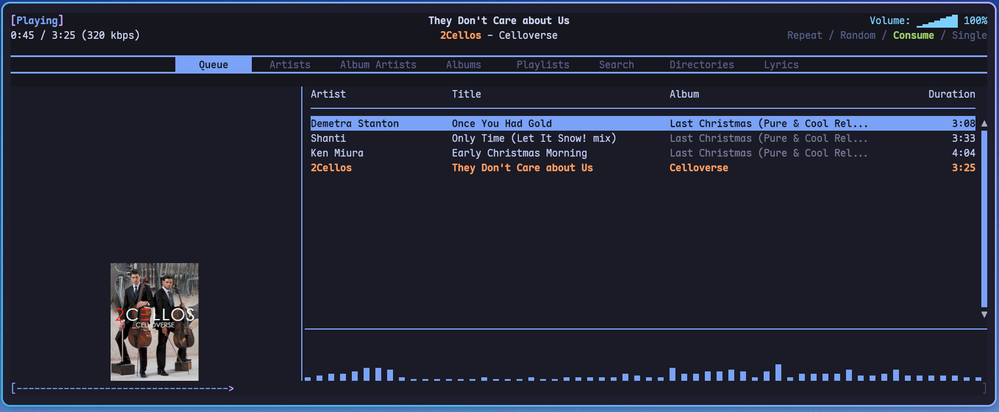

# RMPC Configuration (Kenp Edition)

## 🧠 Overview
This is my highly customized configuration for **rmpc**, a command-line client for MPD (Music Player Daemon). 

This setup features:
- **Unique "Kenp" Theme:** A blend of the "Ashen" layout structure and the "Tokyo Night" color palette (Catppuccin Mocha roots).
- **Dashboard Layout:** A comprehensive Queue view featuring Lyrics, Album Art, Song List, and a live Cava Visualizer all in one screen.
- **Linux Optimizations:** Fully functional `notify-send` integration with album art caching fixes.
- **Smart Scripts:** Unified scripts for play counting, notifications, and library management.

<div align="center">
  <br>
  <em>A snapshot of the rmpc interface showing the dashboard layout.</em>
</div>

## 📂 Directory Structure
```
.
├── config.ron                  # Main rmpc configuration
├── on_song_change.sh           # Unified hook: increments play count & sends notification
├── inspect_log.sh              # Generates genre statistics from logs
├── README.md
├── themes/
│   └── kenp.ron                # Custom Tokyo Night x Ashen Theme
└── utils/
    └── manage_music.sh         # All-in-one utility for lyrics, tagging, and genres
```

## ⚙️ Setup

### 1. Dependencies
- **rmpc:** [Installation Guide](https://mierak.github.io/rmpc/next/overview/)
- **mpd:** Must be running.
- **cava:** Required for the visualizer.
- **libnotify:** For desktop notifications (`notify-send`).
- **jq, curl, eyeD3:** Required by the helper scripts.

### 2. MPD Visualizer Setup
For Cava to work within rmpc, your `mpd.conf` must include a FIFO output:
```conf
audio_output {
    type                    "fifo"
    name                    "Visualizer"
    path                    "/tmp/mpd.fifo"
    format                  "44100:16:2"
}
```

### 3. Installation
1. Clone/copy this repository to `~/.config/rmpc/`.
2. Ensure scripts are executable:
   ```bash
   chmod +x on_song_change.sh utils/manage_music.sh inspect_log.sh
   ```
3. Restart `rmpc`.

## 🎨 Theme: Kenp
The configuration uses a custom theme located at `themes/kenp.ron`.
- **Colors:** Tokyo Night (Storm Background, Blue/Magenta Accents).
- **Layout:** "Dashboard" style split panes.
- **Visualizer:** Integrated Cava bar at the bottom of the queue.

## 🛠️ Utilities (`manage_music.sh`)

The `utils/` directory contains a single powerful script to manage your library.

**Usage:** `./utils/manage_music.sh <command> <directory>`

| Command | Description |
| :--- | :--- |
| `lyrics` | Auto-fetch synced `.lrc` lyrics from LRCLIB for all tracks in the folder. |
| `genre` | Interactively tag genres for each file using `eyeD3`. |
| `tag` | Batch tag metadata (Artist, Album, Title). *Requires a `tracks.txt` file in the folder listing song titles.* |

### Example
```bash
# Fetch lyrics for an album
./utils/manage_music.sh lyrics "~/Music/Daft Punk/Discovery"
```

## 🔔 Notifications
The `on_song_change.sh` script is automatically triggered by rmpc when a track changes. It:
1. Increments the "playCount" sticker in MPD.
2. Sends a desktop notification with the Album Art (handling cache busting automatically).

## 📊 Extras
- **Genre Counts:** Run `./inspect_log.sh` to generate a `genre_counts.txt` file showing your most listened genres based on MPD logs.